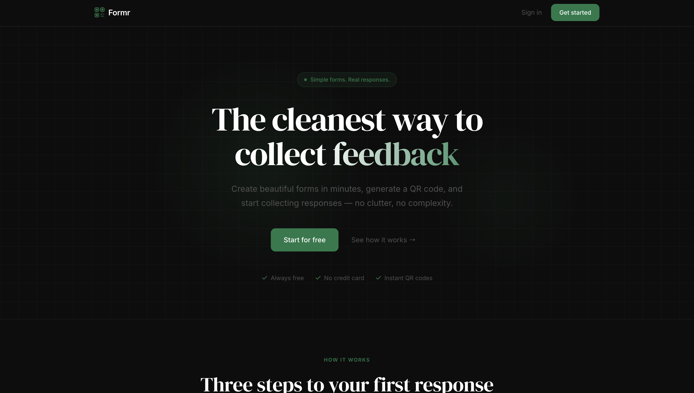
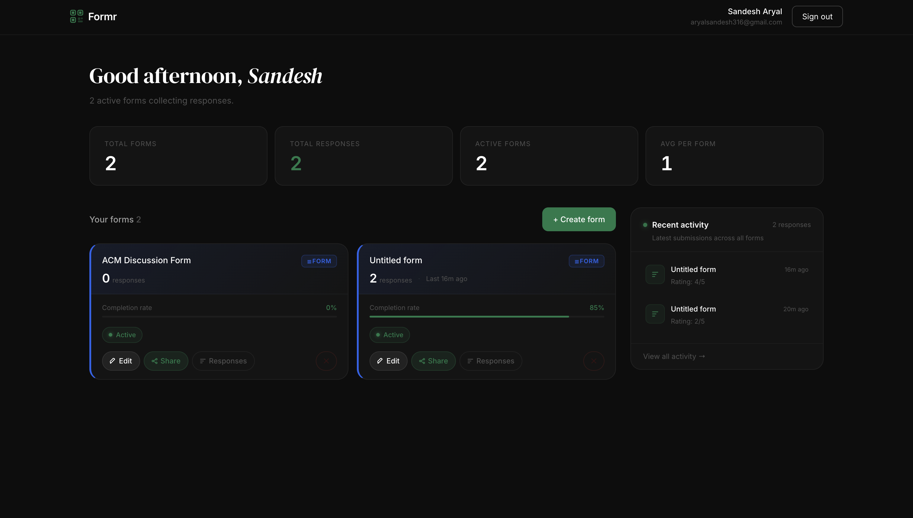
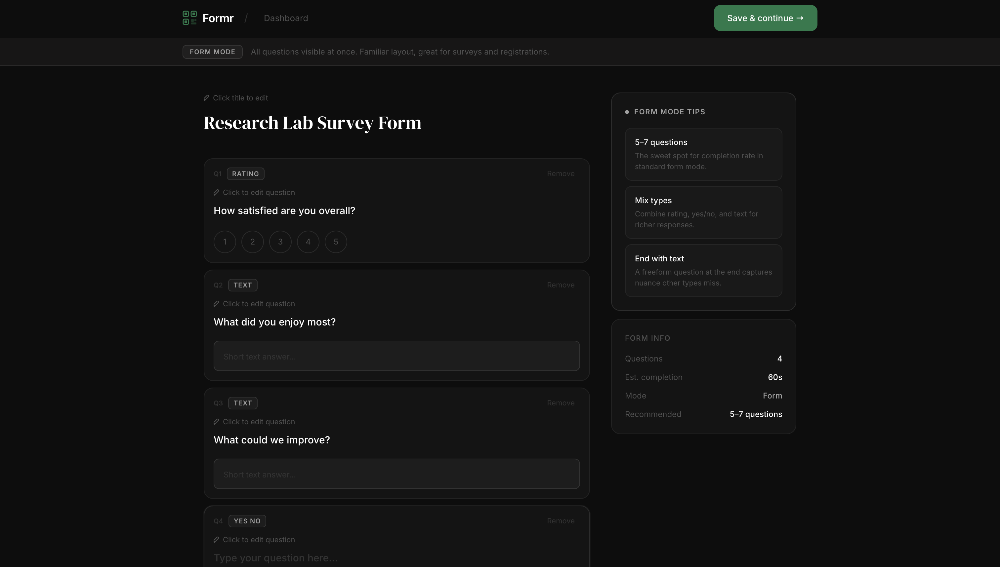
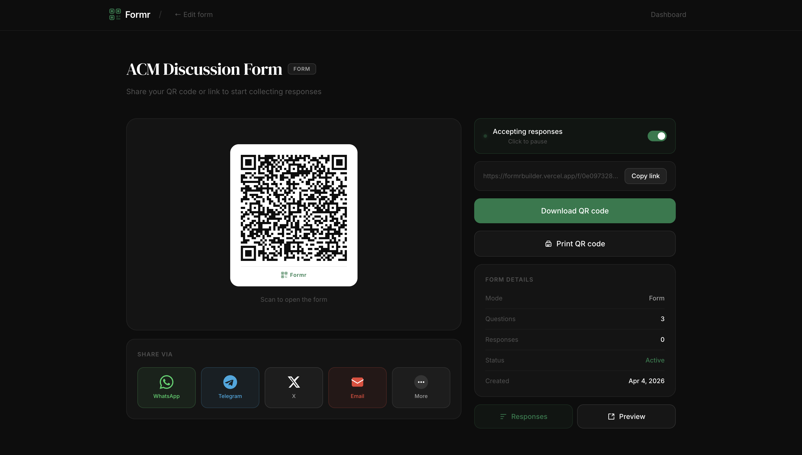

#  Formr

**A modern, QR-native form and feedback platform.**

Create forms, share them instantly via QR code, and collect responses — all from a sleek, dark-themed interface.

🔗 **Live:** [formrbuilder.vercel.app](https://formrbuilder.vercel.app)

---

## Preview

   
   
   
   

---

## Features

- **3 Form Modes** — Quick (single question), Form (multi-question survey), Flow (step-by-step guided)
- **QR Code Sharing** — Generate, download, and share QR codes via WhatsApp, Telegram, X, or Email
- **Smart Onboarding** — Go from account creation to a shareable form link in under 2 minutes
- **Response Analytics** — Summary view with rating distributions, yes/no splits, and text answer breakdowns
- **Full Authentication** — Email/password with verification + Google OAuth
- **CSV Export** — Download response data directly from the dashboard
- **Completion Tracking** — Form views tracked via atomic RPC, giving you real completion rates
- **Active/Inactive Toggle** — Control form availability with a single click

---

## Tech Stack

| Layer       | Technology                              |
|-------------|------------------------------------------|
| Framework   | Next.js (Pages Router), React, TypeScript |
| Styling     | Tailwind CSS                             |
| Backend     | Supabase (PostgreSQL, Auth, RLS)         |
| Deployment  | Vercel                                   |
| Key Libs    | `qrcode.react`, `DM Serif Display`, `Inter` |

---

## Architecture

```
┌──────────────┐     ┌──────────────┐     ┌──────────────────┐
│   Next.js    │────▶│   Supabase   │────▶│   PostgreSQL     │
│   Frontend   │     │   Auth + API │     │   (RLS enabled)  │
│   (Vercel)   │◀────│              │◀────│                  │
└──────────────┘     └──────────────┘     └──────────────────┘
```

**Database Tables:**

- `forms` — Stores form metadata, mode, active status, and view count
- `questions` — Questions linked to forms with ordering, type, and options
- `responses` — Submitted answers stored as JSONB
- Custom RPC: `increment_views()` for atomic view counting

**Row Level Security** enforces data isolation — users can only manage their own forms, while the public can read active forms and submit responses.

---

## Project Structure

```
pages/
├── index.tsx              # Landing page
├── login.tsx              # Auth (email + Google OAuth)
├── dashboard.tsx          # User dashboard with stats
├── 404.tsx                # Custom 404
├── forms/
│   ├── new.tsx            # Form creation onboarding
│   └── [id]/
│       ├── edit.tsx       # Form builder
│       ├── share.tsx      # QR code sharing
│       └── responses.tsx  # Response analytics
├── f/
│   └── [id].tsx           # Public form (respondent view)
└── auth/
    └── callback.tsx       # Auth redirect handler

components/
├── Logo.tsx               # Brand logo component
├── Loader.tsx             # Animated QR loading screen
├── Layout.tsx             # Shared page layout
└── PageWrapper.tsx        # Content wrapper

lib/
└── supabase.ts            # Supabase client config
```

---

## Getting Started

### Prerequisites

- Node.js 18+
- A [Supabase](https://supabase.com) project
- (Optional) Google Cloud project for OAuth

### Setup

1. **Clone the repo**
   ```bash
   git clone https://github.com/sandeshdev667/formr.git
   cd formr
   ```

2. **Install dependencies**
   ```bash
   npm install
   ```

3. **Configure environment variables**

   Create a `.env.local` file:
   ```env
   NEXT_PUBLIC_SUPABASE_URL=your_supabase_url
   NEXT_PUBLIC_SUPABASE_ANON_KEY=your_anon_key
   SUPABASE_SERVICE_ROLE_KEY=your_service_role_key
   NEXT_PUBLIC_APP_URL=http://localhost:3000
   ```

4. **Set up the database**

   Run the following in your Supabase SQL editor:
   ```sql
   -- Create tables for forms, questions, and responses
   -- Enable RLS policies
   -- Create increment_views() function
   ```
   _(Full migration script coming soon)_

5. **Run the dev server**
   ```bash
   npm run dev
   ```
   Open [http://localhost:3000](http://localhost:3000)

---

## Design System

| Element       | Value                            |
|---------------|----------------------------------|
| Background    | `#0D0D0D`                        |
| Card Surface  | `#141414`                        |
| Elevated      | `#1A1A1A`                        |
| Accent        | `#1A7A4A` (green)                |
| Text Primary  | `#FFFFFF`                        |
| Text Muted    | `#505050`                        |
| Border        | `rgba(255,255,255,0.06)`         |
| Headings      | DM Serif Display                 |
| Body          | Inter                            |
| Background FX | Subtle dot grid + green orbs     |

---

## Roadmap

- [x] Email/password authentication with verification
- [x] Google OAuth
- [x] 3 form modes (Quick, Form, Flow)
- [x] QR code generation and sharing
- [x] Response analytics with summary + individual views
- [x] CSV export
- [x] Completion rate tracking
- [ ] Account settings (update profile, change password, delete account)
- [ ] Response analytics charts (trends over time)
- [ ] Template library expansion
- [ ] Custom domain

---

## License

This project is not currently licensed for redistribution. All rights reserved.

---

<p align="center">
  Built by <a href="https://github.com/sandeshdev667">sandeshdev667</a>
</p>
